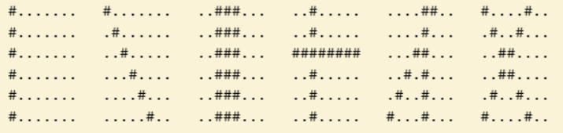
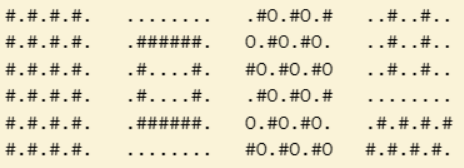

# Övningar: JavaScript

+ Syftet med övningarna är att träna på att skriva kod, snarare än att hitta exakt rätt lösning. Försök att arbeta med så många övningar som möjligt.
+ Det går att lösa de flesta uppgifter på flera sätt. Gå gärna tillbaka till tidigare uppgifter och se om du kan lösa dem på något annat sätt.
+ Innan du kör fast: diskutera din kod med klasskamrater på Discord, eller be Aizo förklara / ge ledtrådar.
+ Titta på uppgift 50 längst ner innan du börjar.

Ett bra sätt att lära sig programmera är att:
1. försöka själv först
1. läsa någon annans kod
1. diskutera kod med någon annan


Använd [playcode.io](https://playcode.io/) för att skriva din kod.

---

1 Läsförståelse. Vad gör följande program?
```js
let b = 100
console.log('1. The value of b is ' + b)
b = b + 10
console.log('2. The value of b is ' + b)
b = b + 20
console.log('3. The value of b is ' + b)

let a = 12
a = a + 1
a += 10
a++
console.log('The value of a is ' + a)
```

2 Skriv ett program som lägger ihop talen `123` och `432`. Spara resultatet i en variabel med namnet `x`. Skriv ut resultatet.

3 Vad skrivs ut av koden?
```js
let b = 'b'
let c = 'c'
let a = 'a' + b + c
console.log('The value of a is ' + a)

let d = 'ab\ncd'
console.log(d)
```

4 Vad skrivs ut av koden?
```js
let a = 10;
let b = a + 5;
a = a + a + b;
console.log("The value of b is " + b);
console.log("The value of a is " + a);
```

5 Vad skrivs ut av koden?
```js
let a = 0;
a = 10;
a = 10;
a = 10;
a = 10;
console.log('The value of a is ' + a);
```

6 Vad skrivs ut av koden?
```js
let a = 2;
a *= 2;
a *= 2;
a *= 2;
console.log("The value of a is " + a);
```

7 Skriv ett program som räknar ut vad man får om man dubblerar talet `5` fyra gånger.

8 Vad skrivs ut av koden? Och varför?
```js
let a;
console.log("The value of a is " + a);
```

9 Vad skriv ut av koden? Varför?
```js
let x = (1 + 2) * (3 - 4)
let y = 1 + (2 * 3) - 4
let z = 1 + 2 * 3 - 4
console.log('Värdet av x är: ', x)
console.log('Värdet av y är: ', y)
console.log('Värdet av z är: ', z)
```


10a Skapa två variabler med namnen `förnamn` och `efternamn`. De ska innehålla ditt namn. Exempel: `let förnamn = 'David'`. Skriv ut båda variablerna med *en* console.log.

10b Om du heter "Anna Andersson" ska utskriften bli: `"Välkommen, Anna Andersson!"`.

---

20 Vad skrivs ut av koden?
```js
let a = 12
let b = 9
if(a <= b) {
	console.log(a)
}
else {
	console.log(b)
}
```

21 Vad skrivs ut av koden?
```js
let a = 20
let b = -5
if( a - b < 12 )
	console.log('liten')
if( a - b < 16 )
	console.log('mellan')
else
	console.log('stor')
```

22 Vad skrivs ut av koden?
```js
let a = 21;
let b = 22;
if(a < b)
	a++
else if(a > b)
	b++
else
	a+=2
console.log(a, b)
```

23 Vad skrivs ut av koden?
```js
let x = 1
let y = 8

if(y >= 4 && y <= 12)
    x++
else
    x--

console.log(x, y);
```


---

30 Vad skrivs ut av koden?
```js
for( let i=5; i<10; i++ ) {
	console.log('i: ', i)
}
```

31 Gör en loop som skriver ut talen 1 till och med 10.

32 Vad skrivs ut av koden?
```js
for( let i=64; i>1; i = i / 2 ) {
	console.log('Värdet av i är: ', i)
}
```

33 Vad skrivs ut av koden?
```js
for( let i=15; i>11; i-- ) {
	console.log('Värdet av i är: ', i)
}
```

34 Skriv ett program som skriver ut alla jämna tal 2, 4, 6 osv. till och med 20.

35 Vad skrivs ut av koden?
```js
let x = 0
for( let i=1; i<=5; i++ ) {
	x += i
}
console.log('Värdet av x är: ', x)
```

36 Vad skrivs ut av koden?
```js
const x = 61
for( let i=1; i<=10; i++ ) {
	let j = (i - 1) * i
	if( j > x ) {
		console.log('Värdet är: ', j)
	}
}
```

37 Skriv kod som skriver ut talen `1 till 5`, `11 till 15` och `21 till 25`. Försök komma på flera olika sätt att göra det på.

38 Tecknet `%` kallas "modulo" och används bland annat för att avgöra om ett tal är udda eller jämnt. Använd detta för att skriva ut alla udda tal mellan 20 och 40. Exempel:
```js
if( x % 2 === 0 ) {
	// talet är jämnt
}
if( x % 2 === 1 ) {
	// talet är udda
}
```

39 Vad skrivs ut av koden?
```js
for( let i=0; i<=30; i+=3 ) {
	console.log('Värdet är: ', i++)
}
```

40 Vad skrivs ut av koden?
```js
let s = ''
let t = 'x'
let i = 0
let j = 0
for( i = 0; i <= 3; i++ ) {
	for( j = 0; j <= 3; j++ ) {
		s += t
	}
	s += "\n"
	if(t === "x")
		t = "o"
	else
		t = "x"
}
console.log(s);
```

41 Modifiera koden ovan, så att den producerar följande figurer.





---

50 Om du har klarat av de flesta av frågorna, leta upp någon JavaScript-artikel eller video på nätet. Dela med dig på Discord om du hittar något du tycker är bra.

+ [The Modern JavaScript Tutorial](https://javascript.info/)  - lättanvänd referens till de viktiga delarna av JavaScript
+ [Programming with Mosh | YouTube](https://www.youtube.com/playlist?list=PLTjRvDozrdlxEIuOBZkMAK5uiqp8rHUax)
+ [JavaScript from Beginner to Master | dev.](https://dev.to/cliff123tech/series/23246)
+ [JavaScript for Cats](http://jsforcats.com/)  (lite daterad, men lättläst och bra skriven)
+ [Eloquent JavaScript 4th edition](https://eloquentjavascript.net/)  (för dig som gillar att läsa teori, förklarar grundligt)
